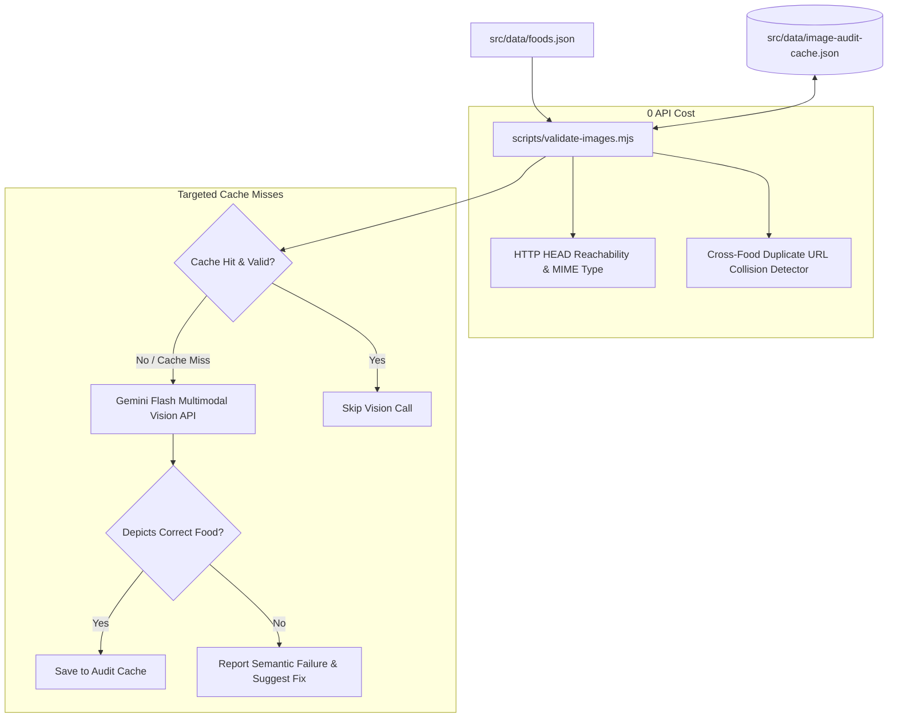

# Architecture Spine: Food Image Accuracy & Semantic Verification Engine

> **Scope**: Automated test suite and validation engine to ensure each food in `foods.json` has a correct, working, and semantically accurate image.  
> **Status**: DRAFT (Fast Path)  
> **Altitude**: Feature Architecture  

---

## 1. Architectural Paradigm & Invariants



### Core Invariants:
1. **No Broken Links Reach Production**: Any food with non-200 HTTP status, timeout, or non-image MIME type fails the test runner.
2. **No Accidental Placeholder/Image Collisions**: Two distinct foods cannot share an identical image URL unless explicitly declared as a known botanical/preparation variant (e.g. `Atlantic Salmon` vs `Farmed Atlantic Salmon`).
3. **Semantic Grounding via AI Multimodal Vision**: A visual check confirms the picture actually depicts what the food item is called.
4. **Content-Addressed Audit Cache**: Image audits are hashed (`sha256(food.id + food.image)`) so that stable images only consume API quota once.

---

## 2. Architectural Decisions (ADs)

### AD-1: Two-Tiered Audit Pipeline
- **Binds**: Separation of quick static/network checks from AI vision queries.
- **Prevents**: Slow CI builds, API quota exhaustion, and unneeded network overhead.
- **Rule**:
  - `Tier 1` (Static + Network): Validates HTTPS, runs concurrent `HEAD` requests (200 OK, `image/*`), and runs cross-food duplicate detection. Runs in <2 seconds.
  - `Tier 2` (Semantic Vision): Evaluates image content against food metadata using Gemini Vision. Runs only on cache misses or when `--all` is specified.

### AD-2: Gemini Flash Multimodal Semantic Verifier
- **Binds**: Using `@google/generative-ai` with `gemini-2.0-flash` (or `gemini-1.5-flash`) via existing `GEMINI_API_KEY`.
- **Prevents**: Subjective or manual visual QA; detects when an image is technically valid (HTTP 200) but represents the wrong food (e.g. banana assigned to eggplant).
- **Rule**:
  - Gemini is prompted with strict JSON schema:
    ```json
    {
      "isMatch": boolean,
      "detectedFood": string,
      "confidence": "high" | "medium" | "low",
      "reason": string
    }
    ```
  - An item fails verification if `isMatch === false` with `confidence === "high" | "medium"`.

### AD-3: Content-Addressed Audit Caching
- **Binds**: Cache key schema and persistence file location.
- **Prevents**: Repeated billable API calls and slow test runs across CI and local dev.
- **Rule**:
  - Cache file stored at `src/data/image-audit-cache.json` and committed to git.
  - Key format: `hash = sha256(id + ":" + imageUrl)`.
  - Cache record: `{ verifiedAt, isMatch, detectedFood, confidence, model }`.
  - Changing an image URL in `foods.json` automatically generates a new hash, invalidating the stale entry and triggering re-verification.

### AD-4: CLI & CI Workflow Integration
- **Binds**: Developer tooling and automation commands.
- **Prevents**: Silent regressions going unnoticed before pushing or deploying to Firebase.
- **Rule**:
  - `npm run test:images`: Runs full pipeline (Tier 1 for all items + Tier 2 on cache misses).
  - `npm run test:images:quick`: Runs Tier 1 only (instant duplicate & broken link detection, 0 cost).
  - `npm run test:images:fix`: Runs verification and outputs suggested Unsplash search queries or replacement URLs for failed items.

---

## 3. Assumptions & Defaults `[ASSUMPTION]`

1. `[ASSUMPTION]` **API Availability**: Developers and CI runners have access to `GEMINI_API_KEY` (already configured in `.env`). If running in an offline environment, `npm run test:images:quick` runs without requiring an API key.
2. `[ASSUMPTION]` **Acceptable Variant Sharing**: A whitelist of legitimate shared variants (e.g., wild vs. farmed salmon, butter vs. clarified butter) is permitted to share images without failing the duplicate detector.
3. `[ASSUMPTION]` **Concurrency Limit**: Network requests to Unsplash CDN and Gemini API are throttled to a concurrency limit of 5 to avoid CDN rate-limiting or 429 errors.

---

## 4. Deferred Decisions

- **Automated Image Self-Healing**: Automatically querying Unsplash API to replace failed images directly during the test run (deferred to avoid uncontrolled automated data mutation; flagged for human review first).
- **Local Image Bundling**: Downloading all 128 images into `public/images/foods/` instead of hotlinking Unsplash CDN (deferred for future performance optimization).
